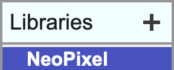

# NeoPixels - micro:bit

Connect the micro:bit to MicroBlocks and add the NeoPixel library.

&nbsp;&nbsp;&nbsp;&nbsp;&nbsp;&nbsp;&nbsp;&nbsp;&nbsp;&nbsp;

Problems? See [Get Started](https://microblocks.fun/get-started).

Connect a NeoPixel strip using alligator clips or an extension board.

&nbsp;&nbsp;&nbsp;&nbsp;&nbsp;&nbsp;&nbsp;&nbsp;&nbsp;&nbsp;&nbsp;&nbsp;&nbsp;&nbsp;&nbsp;&nbsp;&nbsp;&nbsp;&nbsp;&nbsp;

Drag the attach LED NeoPixel block to the scripting area.  Input both the number of NeoPixels on your strip and the pin to which the strip is connected, then run it.

Drag the set NeoPixels block to the scripting area and click on it. Your NeoPixels should light up!

CC BY-SA 4.0 http://microblocks.fun v1.0

Change the color by selecting the green circles and customizing them. 

&nbsp;&nbsp;&nbsp;&nbsp;&nbsp;&nbsp;&nbsp;&nbsp;&nbsp;&nbsp;

To make it look like the rainbow is moving, rotate the NeoPixels by one forever after the program has started.

CC BY-SA 4.0 http://microblocks.fun v1.0

DEBUG THIS:

