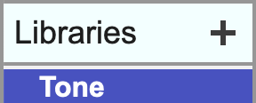
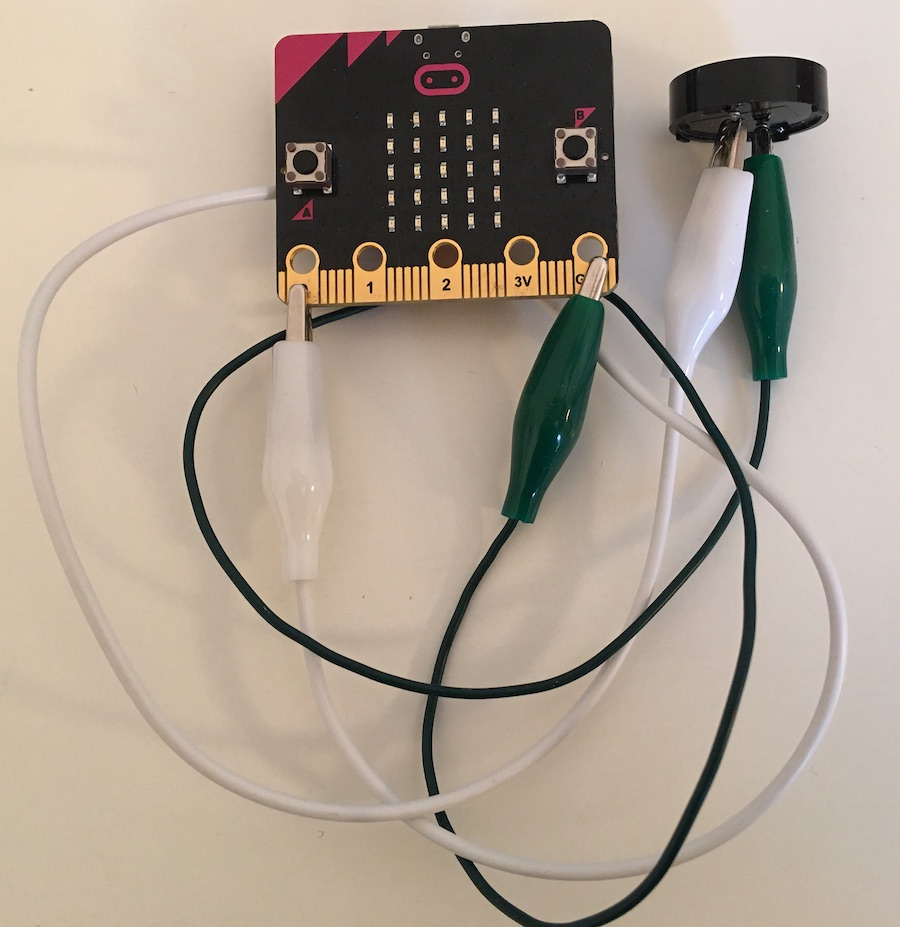
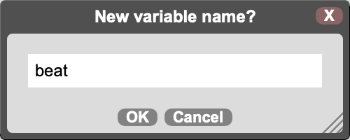

# Sounds - micro:bit

Connect the micro:bit to MicroBlocks and add the Tone library.

&nbsp;&nbsp;&nbsp;&nbsp;&nbsp;&nbsp;&nbsp;&nbsp;&nbsp;&nbsp;

Problems? See [Get Started](https://microblocks.fun/get-started).

Connect a piezo speaker or headphones to pin 0 using alligator clips or an extension board.

&nbsp;&nbsp;&nbsp;&nbsp;&nbsp;&nbsp;&nbsp;&nbsp;&nbsp;&nbsp;

Click a *play note* block to play one note. Experiment with the note, octave, and duration to make different notes.

Put *play note* blocks together to make tunes.

Select open and choose the music folder to see more examples of songs!

&nbsp;&nbsp;&nbsp;&nbsp;&nbsp;&nbsp;&nbsp;&nbsp;&nbsp;&nbsp;

Using a variable for note durations lets you change the speed.  Click on the variables category to create a new variable.

&nbsp;&nbsp;&nbsp;&nbsp;&nbsp;&nbsp;&nbsp;&nbsp;&nbsp;&nbsp;&nbsp;&nbsp;&nbsp;&nbsp;&nbsp;&nbsp;

Now you can customize the length of the note easily in the play note block. Use the repeat block for parts of the song that repeat. 

What happens when you change the beat from 200 to 50?

Want to make a sound effect? 
Try this!

